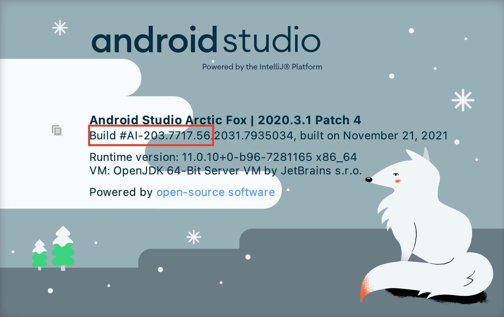

# hh-histories-view-binding-migration-plugin

<!-- Plugin description -->
**HH Synthetic** -- plugin for automated migration from Kotlin synthetics to View Binding.
<!-- Plugin description end -->

## Setup for local development

- Create `local.properties` file in root folder with the following content:

```properties
# Properties for launching Android Studio
androidStudioPath=/Users/p.strelchenko/Library/Application Support/JetBrains/Toolbox/apps/AndroidStudio/ch-0/203.7935034/Android Studio.app
androidStudioCompilerVersion=203.7717.56
```

Here:

- `androidStudioPath` - Path to your local Android Studio;
- `androidStudioCompilerVersion` - this version you could get from `About` screen of Android Studio


